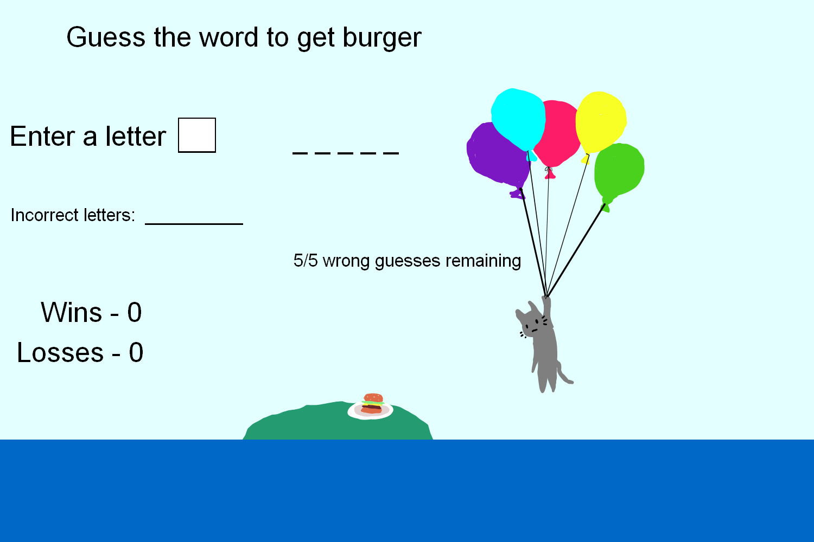

# Burger Quest | Burgernauts

## Code Institute - Hackathon 1

[Click Here to view the Live Project.](https://richfletch92.github.io/Burger-Quest/)

[Click here to view the Repository.](https://github.com/Richfletch92/Burger-Quest)

## Meet the team
- Richard - [Github](https://github.com/Richfletch92)
- Jo - [Github](https://github.com/Jo-JPEG)
- Moe - [Github](https://github.com/moe-ysf)
- Sardar - [Github](https://github.com/SardarAmiri)

## Table of Contents

- [About](#about)
- [User Value Explanations](#user-value-explanations)
- [Installation](#installation)
    - [Dependencies](#dependencies)
- [How to Play](#how-to-play)
- [Design](#design)
- [General Features](#general-features)
- [Future Features](#future-features)
- [AI Overview](#ai-overview)
- [Things to be Improved](#things-to-be-improved)
- [Technologies Used](#technologies-used)
- [Validation](#validation)
    - [HTML](#html)
    - [CSS](#css)
    - [JavaScript](#javascript)
- [Lighthouse Performance](#lighthouse-performance)
    - [Mobile](#mobile)
    - [Desktop](#desktop)
- [Wireframes](#wireframes)

## About
Burger Quest is an interactive and engaging word-guessing game designed for players of all ages. The primary goal of the game is to guess the hidden word by selecting letters within a limited number of attempts. The game offers various difficulty levels to cater to different skill sets, making it both challenging and entertaining. The project was developed as part of a hackathon organized by Code Institute, with a focus on creating a fun and educational experience that helps improve vocabulary and spelling skills. The design is kid-friendly, featuring vibrant colors and playful animations to enhance the user experience.

## User Value Explanations
- **Entertainment**: The game provides a fun and engaging way to pass the time.
- **Challenge**: Different difficulty levels offer varying degrees of challenge, keeping the game interesting.
- **Learning**: Players can improve their vocabulary and spelling skills while playing.
- **Accessibility**: The game is easy to understand and play, making it accessible to a wide audience.

## Installation
- Clone or download the repository.
- Open the index.html file in your browser.
### Dependencies
The game does not require external libraries. All styles and scripts are included in the project.

## How to Play
1. Open the game in your browser.
2. Select a difficulty level (Easy, Medium, or Hard).
3. Guess letters by either:
    - Clicking buttons on the on-screen keyboard.
    - Typing a letter in the text box and clicking "Submit."
4. The game provides feedback:
    - Correct guesses reveal the letter(s) in the word.
    - Incorrect guesses decrease your remaining attempts.
5. Win by guessing the word before running out of attempts.
6. Lose if attempts reach zero without guessing the word.

## Design

- **Colours**: List the colours used in your project.
    - Main Background: #B1F0F7
    - Game Background: #F5F0CD
    - Title Colour: #fca644
    - Text Colour: #333
    - Button Colour: #37bdf7
    - Button Hover: #B1F0F7
    - Button Text: #FFF8DE
    - Button Text Hover: #727272
    - Reset Colour: #fca644
    - Reset Hover: #ffcd94
    - Keyboard Colour: #37bdf7
    - Keyboard Hover: #B1F0F7

- **Fonts**: List the fonts used in your project.
    - Main font: [Nunito](https://fonts.google.com/specimen/Nunito)
    - Header font: [UnifrakturMaguntia](https://fonts.google.com/specimen/UnifrakturMaguntia)

- **Images**: 
    All images were designed and created by Jo. The designs are aimed towards kids to provide a fun and interactive experience. 

## General Features

- Difficulty Levels: Easy, Medium, and Hard with varying word complexity and attempts.
- Interactive Keyboard: Clickable on-screen keyboard to make guesses.
- Text Entry: Option to type guesses via a text box.
- Animations: Floating burger and cat animations to enhance gameplay.
- Hint Feature: Reveal a letter to assist with challenging words.
- Score Tracking: Tracks wins and losses.
- Reset Option: Restart the game at any time.
- Responsive Design: Optimized for various screen sizes.

## Furture Features

- Different image designs depending on level difficulty 
- Count down timer which changes length depending on difficulty 
- Animation for balloons popping
- Background images for better perception 
- Multiplayer Mode: Add a mode where players compete or collaborate.
- Additional Levels: Include more difficulty levels or themed word lists.
- Leaderboard: Save and display high scores.

## AI Overview

- Ai was used to generate the words for the game and hints. 
- It was also used to bug check code when having problems.
- It was used to help create JavaScript functions.

## Technologies Used

- **HTML5**: For structuring the content.
- **CSS3**: For styling the website.
- **JavaScript**: For Game logic and interactivity.
- **Google Fonts**: For font styles.
- **Co-Pilot**: For code generation and debugging.
- **Chat-GPT**: For Q & A and code generation.
- **favicon.io**: For creation of favicons.

## Validation

### HTML

### CSS

### JavaScript

## Wireframes

### Initial Ideas Wireframes

### Gameplay Wireframes

### Mobile Layout Wireframe

## Lighthouse Performance

### Mobile

### Desktop

